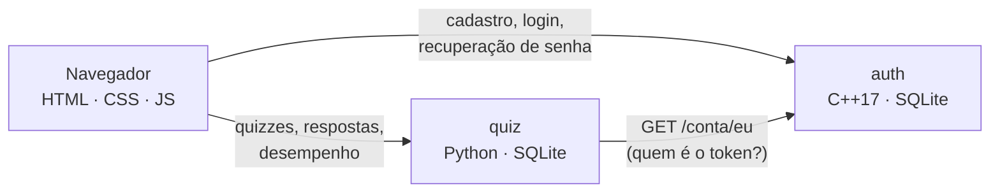

# fiap-challange · Anamnea Quizzes

Projeto do **Challenge FIAP 2026**. É o módulo de quizzes da [Anamnea](https://www.anamnea.com.br) separado em três serviços, cada um numa linguagem:

| Parte | Linguagem | O que faz |
|---|---|---|
| [`auth/`](auth) | **C++17** | Cadastro, login, sessão e recuperação de senha |
| [`quiz/`](quiz) | **Python 3.12** | Banco de 120 questões, correção, XP e ranking |
| [`web/`](web) | **HTML, CSS e JS puros** | A interface, seguindo o design system da Anamnea |

## Links para teste

| O quê | Link |
|---|---|
| **Site** | https://challenge.pervian.tech |
| API de autenticação (C++) | https://challenge-auth.pervian.tech/saude |
| API de quizzes (Python) | https://challenge-quiz.pervian.tech/quizzes |

Para testar: crie uma conta em https://challenge.pervian.tech/cadastro.html, faça um quiz e veja o XP em **Desempenho**. Na recuperação de senha (https://challenge.pervian.tech/recuperar-senha.html) o código de 6 dígitos aparece na própria tela, porque o ambiente da entrega roda em modo demonstração, sem servidor de e-mail.

## Equipe

- Artur Figueiredo Vianna
- Cassiano Rocha Assumpção
- Pedro Perraro John

## Como funciona

1. O aluno cria a conta e entra. Quem responde é o serviço em C++.
2. Escolhe um dos 16 quizzes (oito disciplinas do ciclo básico, dois níveis cada).
3. Responde uma questão por vez e vê a correção e a explicação na hora. A primeira resposta é a que vale; “Não sei” conta como erro.
4. Ao concluir, soma XP: **10 por acerto e 20 de bônus** para quem acerta todas. Só a primeira conclusão do dia em cada quiz rende XP, para ninguém subir no ranking refazendo o mesmo quiz.
5. A tela de desempenho mostra XP, aproveitamento, histórico e o ranking da turma.

As questões vêm do banco de questões da Anamnea (16 quizzes, 120 questões): Anatomia, Bioquímica, Embriologia, Fisiologia, Genética, Histologia, Semiologia e Saúde Coletiva.

## Arquitetura



- O navegador guarda só o **token** de sessão e manda como `Authorization: Bearer`.
- O serviço de quizzes não sabe nada de senha: pergunta ao `auth` quem é o dono do token (com cache de 1 minuto).
- Cada serviço tem o próprio banco SQLite. Nenhum lê o banco do outro.
- O gabarito nunca vai para o navegador: a correção acontece no Python, questão a questão.

### Segurança da autenticação (C++)

- Senha guardada com **PBKDF2-HMAC-SHA256**, 210 mil iterações e sal aleatório (OpenSSL).
- Token de sessão com 32 bytes aleatórios, gravado no banco só como SHA-256. Vale 7 dias.
- **Cinco senhas erradas seguidas bloqueiam o login por cinco minutos.**
- Login com e-mail inexistente leva o mesmo tempo que com senha errada, e a mensagem é a mesma: a tela não revela quem tem conta.
- Recuperação por **código de 6 dígitos**, válido por 15 minutos e por 5 tentativas, gravado como hash. Trocar a senha derruba todas as sessões abertas.
- O nginx limita as rotas de conta a 10 pedidos por minuto por IP.

> **Modo demonstração.** O ambiente da entrega não tem servidor de e-mail, então com `MODO_DEMO=1` o código de recuperação volta na resposta e aparece na tela. Sem essa variável, ele só é gerado.

## Rodando na sua máquina

Com Docker:

```bash
docker compose up --build
```

Abra http://localhost:8080. O `auth` fica em `:8092` e o `quiz` em `:8093`.

Sem Docker, em três terminais:

```bash
# 1. auth (precisa de g++, cmake, libssl-dev e libsqlite3-dev)
cmake -S auth -B auth/build && cmake --build auth/build -j
MODO_DEMO=1 ./auth/build/anamnea-auth

# 2. quiz (só a biblioteca padrão do Python 3.12)
cd quiz && python -m app

# 3. web (qualquer servidor estático)
python -m http.server 8080 -d web
```

## Testes

```bash
ctest --test-dir auth/build --output-on-failure   # C++: 18 casos
cd quiz && python -m unittest -v                  # Python: 24 casos
npx html-validate "web/*.html"                    # HTML
```

O GitHub Actions roda os três a cada pull request. As imagens Docker também rodam os testes no build: imagem com teste quebrado não chega a existir.

## API

### auth (C++) — `https://challenge-auth.pervian.tech`

| Método | Rota | Corpo | Resposta |
|---|---|---|---|
| `POST` | `/conta/cadastro` | `{nome, email, senha}` | `201 {usuario}` |
| `POST` | `/conta/login` | `{email, senha}` | `200 {token, expira_em, usuario}` |
| `GET` | `/conta/eu` | — (Bearer) | `200 {usuario}` |
| `POST` | `/conta/sair` | — (Bearer) | `204` |
| `POST` | `/conta/recuperar-senha` | `{email}` | `202 {mensagem}` |
| `POST` | `/conta/redefinir-senha` | `{email, codigo, nova_senha}` | `200 {mensagem}` |
| `GET` | `/saude` | — | `200 {status}` |

### quiz (Python) — `https://challenge-quiz.pervian.tech`

| Método | Rota | Corpo | Resposta |
|---|---|---|---|
| `GET` | `/quizzes?disciplina=` | — | `{disciplinas, quizzes}` |
| `GET` | `/quizzes/{id}` | — | quiz sem o gabarito |
| `POST` | `/quizzes/{id}/tentativas` | — (Bearer) | `201 {tentativa_id, quiz}` |
| `POST` | `/tentativas/{id}/respostas` | `{posicao, escolha}` | `{acertou, correta, explicacao, respondidas, total}` |
| `POST` | `/tentativas/{id}/concluir` | — (Bearer) | `{acertos, total, xp_ganho, xp_total, primeira_do_dia}` |
| `GET` | `/eu/resumo` | — (Bearer) | XP, aproveitamento e histórico |
| `GET` | `/ranking` | — | as 10 pessoas com mais XP |

Erros saem sempre como `{"erro": "mensagem para o usuário"}`, com o status HTTP certo (`401`, `404`, `409`, `422`, `429`).

## Interface

HTML, CSS e JavaScript sem framework e sem etapa de build; cada página carrega só os módulos ES de que precisa.

- **Design system da Anamnea:** paleta cobalto, Archivo nos títulos e Nunito no texto, botões com sombra sólida que afundam no clique, pills de escolha que ficam verdes ou vermelhas na correção e o mascote Vento reagindo às respostas. Os tokens estão em [`web/css/tokens.css`](web/css/tokens.css).
- **Semântica:** `header`, `nav`, `main`, `section` e `footer` em todas as páginas; alternativas do quiz são `radio` dentro de `fieldset`; progresso com `<progress>`; histórico em `<table>`; números em `<dl>`; avisos com `role="alert"`.
- **Responsiva e mobile first:** no celular a navegação vira tab bar embaixo e o painel de correção fica ao alcance do polegar; alvos de toque com pelo menos 44px.
- **Acessível:** foco visível, link de pular para o conteúdo, foco levado ao enunciado a cada questão, `prefers-reduced-motion` respeitado.

## Estrutura

```
auth/              serviço de autenticação (C++17)
  src/             cripto, validação, banco, contas, recuperação, rotas HTTP
  tests/           testes sem framework, rodados pelo ctest
quiz/              serviço de quizzes (Python 3.12)
  app/             catálogo, regras da tentativa, repositório, cliente do auth, servidor
  dados/           quizzes.json, o banco de questões
  tests/           unittest
web/               interface (HTML, CSS, JS)
  css/             tokens, base, componentes, layout e estilos por tela
  js/              api, sessão, formulários e um módulo por página
deploy/            nginx, compose de produção e script de deploy
```

## Deploy

A VPS roda os dois serviços em containers presos ao `127.0.0.1`; o nginx do host serve o site estático e faz o proxy com HTTPS (Let's Encrypt).

| Subdomínio | Aponta para |
|---|---|
| [`challenge.pervian.tech`](https://challenge.pervian.tech) | `web/`, estático |
| [`challenge-auth.pervian.tech`](https://challenge-auth.pervian.tech/saude) | `auth`, porta 8092 |
| [`challenge-quiz.pervian.tech`](https://challenge-quiz.pervian.tech/saude) | `quiz`, porta 8093 |

```bash
./deploy/deploy.sh   # atualiza /opt/fiap-challange, recompila e publica
```

## Fluxo de trabalho

Cada funcionalidade nasce numa branch própria (`feat/…`, `fix/…`, `ci/…`, `docs/…`), passa pelos testes e entra na `main` por pull request revisado por outra pessoa da equipe.
